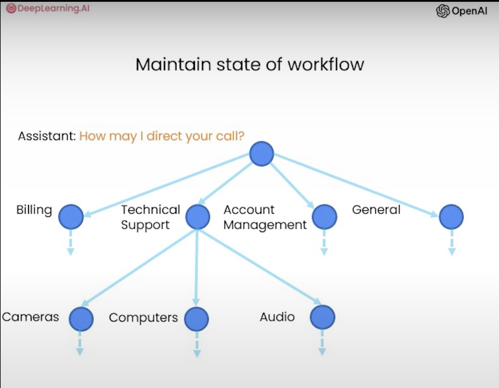

# Building Systems with the ChatGPT API
*course link: [https://learn.deeplearning.ai/courses/chatgpt-building-system](https://learn.deeplearning.ai/courses/chatgpt-building-system)*

## How LLM work

LLM is know for text generation ability based on the next **token** not *word*. One of the core building blocks for LLM is supervised learning approach by repeatedly predict the next token. 
|              **Input**              | **Output** |
|-------------------------------------|------------|
| I like to eat                       | Falafel    |
| I like to eat Falafel               | sandwich   |
| I like to eat Falafel sandwich      | with       |
| I like to eat Falafel sandwich with | Tahini     |

### LLM types

1. Base LLM
    * General LLM trained on a huge amount of data to predict the next token
    * Might have hard time to answer questions
    * Take months to be trained

2. Instruction Tuned LLM
    * It is based on a Base LLM
    * Then further train the model in a small set of examples where the output follows an input instruction
    * After that, to improve the quality of the output, you take a human rating of the output based on specific criteria like **3H**(Honest, Harmless, Helpful)
    * Finally, you can further tune the LLM to increase the probability that it generates more highly rated output using **RLHF**(Reinforcement Learning based on Human Feedback)
    * Take days to be trained

### Tokenization
* ChatGPT LLM is based on tokenization of words, this is why it predict next token
* This make ChatGPT fail with simple tasks, and needs special guidance, like giving separators, to accomplish simple tasks that is based on [characters reverse](./how-llm-work/reverse.py) as example
* [1 token is equal to 3/4 word or equal to 4 characters](./how-llm-work/token_count.py)
* Some limitations:
    * ChatGPT models depends on total # of tokens which is the sum of the input`(context)` + output`(completion)` tokens
    * Chatgpt 3.5 Turbo has a limit of 4K total tokens

### Chat Format/Model

OpenAI chat model support 3 different types of roles per message when you leverage the model:
1. System Role: Gives overall instruction and guidelines for the chat model
2. Assistant Role: Is the agent the will keep communicating with the user based on the earlier instruction passed to the system
3. User Role: Is the user messages

[Refer to this section for examples](./../chatgpt-prompt#chatbot)


## Classification

Task to evaluate inputs to ensure the quality and safety of the system. For tasks that depends on a different set of instructions, it would be beneficial to first classify the type of the query then you use that classification to determine which instructions to use.

[A good example](./classification/categories.py) would be a customer service bot would first identify the main category then a secondary category to take the proper action.


## Moderation

For ensuring users using the model in a responsible way, so is not being abused.

1. OpenAI moderation API
The [moderation endpoint](https://platform.openai.com/docs/guides/moderation) is a tool you can use to check whether text is potentially harmful. It classify a text based on a list of categories and it is free of charge. It also return `flagged` property that can tell you if the content is harmful or not. Yet, it is not accurate and you might need to calibrate based on your need.
```python
response = client.moderations.create(
    input="""
    Here's the plan.  We get the warhead, 
    and we hold the world ransom...
    ...FOR ONE MILLION DOLLARS!
    """
    )
moderation_output = response.results[0]
print(moderation_output)
```
```json
{"categories":{"harassment":false,"harassment_threatening":false,"hate":false,"hate_threatening":false,"self_harm":false,"self_harm_instructions":false,"self_harm_intent":false,"sexual":false,"sexual_minors":false,"violence":false,"violence_graphic":false,"self-harm":false,"sexual/minors":false,"hate/threatening":false,"violence/graphic":false,"self-harm/intent":false,"self-harm/instructions":false,"harassment/threatening":false},"category_scores":{"harassment":0.021133190020918846,"harassment_threatening":0.023883499205112457,"hate":0.00740436278283596,"hate_threatening":0.0011366058606654406,"self_harm":0.00005140675784787163,"self_harm_instructions":6.138993313697938e-8,"self_harm_intent":5.514574695553165e-6,"sexual":0.000020699104425148107,"sexual_minors":0.000053819003369426355,"violence":0.39627525210380554,"violence_graphic":0.00041140467510558665,"self-harm":0.00005140675784787163,"sexual/minors":0.000053819003369426355,"hate/threatening":0.0011366058606654406,"violence/graphic":0.00041140467510558665,"self-harm/intent":5.514574695553165e-6,"self-harm/instructions":6.138993313697938e-8,"harassment/threatening":0.023883499205112457},"flagged":false}
```
[Here is the source code of the example.](./moderation/harmful_content.py)

2. Prompt injections
This will prevent security issues, ensure responsible use, and save cost. Best practices:
* [Use input delimiters as part of the instructions](./moderation/prompt_injection.py)
* [Use additional prompt to teach the model how to deal with injection attempts](./moderation/prompt_injection2.py)


## Chain of thoughts reasoning

Take input and generate output through a series of steps, reasoning. Asking for a series of relevant steps will help the model to take its time to reason for the answer and get better output that you also trust.

Here is example of teaching the model om how to reason based on available products and customer input:
1. [Setting up context](./reasoning/context_setup.py)
2. [Simple product comparison](./reasoning/simple_comparision.py)
3. [Simple inquiry of non existing product](./reasoning/inquiry_no_comparision.py)


## Chaining Prompts
Splitting complex tasks into a chain of simple tasks to simplify the reasoning, chain prompts. Because of:
1. Ambiguity 
2. Complex dependencies
Each subtask will only contain the actions relevant to the subtask, which make the task:
1. Easier to manage
2. Make sure the system has all necessary information to carry on the task
3. Reduce the likely hood of errors
4. Reduce the number of tokens used in a prompt. Skip some chains of the workflow when not needed for the task
5. Easier to test, and can include human in the loop
6. Allow the model to use external tools(web search, database)

To summarize: For complex tasks keep track of state external to your LLm(in your own code)

[Example, customer is asking for products information, the model will identify the products then summarize the found products information to the customer.](./chain-prompt/simple_inquiry.py)



## Check outputs

Checking quality, relevance, and safety of the outputs before showing them to customer. This can be done by:
1. [Using moderation API to check the output](./checkout_output/moderation.py)
2. Check if output is factually based on the provided product information. [Here is an example of both positive and negative answers](./checkout_output/check_response.py)


## End to End System with Evaluation and Optimization

### Process of building AI applications


### [Example of End to End AI Assistance for Electronic Store](./end-to-end-system/simple_chatbot.py)

1. Step 1: Pass input moderation check.
2. Step 2: Extract list of products.
3. Step 3: Look up product information.
4. Step 4: Generate response to user question.
5. Step 5: Pass response moderation check.
6. Step 6: Model evaluate the response.
7. Step 7: Model approve the response.


### Evaluation and Optimization
Here are the steps you can follow to evaluate system outcomes and optimize system performance(steps 4,5 are extra and usually for enterprise systems)
1. [Tune prompts on handful examples(few shots)](./end-to-end-system/evaluate_product_queries_v1.py)
2. [Add additional "tricky" examples opportunistically](./end-to-end-system/evaluate_product_queries_v2.py)
3. Develop[ metrics to measure performance](./end-to-end-system/score_product_queries.py) on examples, this approach [if applied using handful set of examples it could be so effective](./end-to-end-system/score_product_test_set.py), not like regular AI testing approaches
4. Collect randomly sampled set of example to tune to (develop set/hold-out cross validation set)
5. Collect and use a hold-out cross test set


### Evaluation design patterns
1. [Write a set of guidelines(rubric)](./end-to-end-system/evaluate_with_rubric.py)

2. [Use expert input and compare](./end-to-end-system/evaluate_with_expert.py)


3. Follow [G-Eval framework](https://arxiv.org/pdf/2303.16634.pdf) [implemented by OpenAI](https://github.com/openai/openai-cookbook/tree/main/examples/evaluation). 
* We define four distinct criteria:
    * Relevance: Evaluates if the answer includes only important information and excludes redundancies.
    * Coherence: Assesses the logical flow and organization of the answer.
    * Consistency: Checks if the answer aligns with the facts in the related products.
    * Fluency: Rates the grammar and readability of the answer.
* We craft prompts for each of these criteria, taking the related products and the answer as inputs, and leveraging chain-of-thought generation and guiding the model to output a numeric score from 1-5 for each criteria.
* We generate scores from gpt-4 with the defined prompts.
* [Here is an example that demonstrates the above steps.](./end-to-end-system/evaluate_with_g_eval.py)


